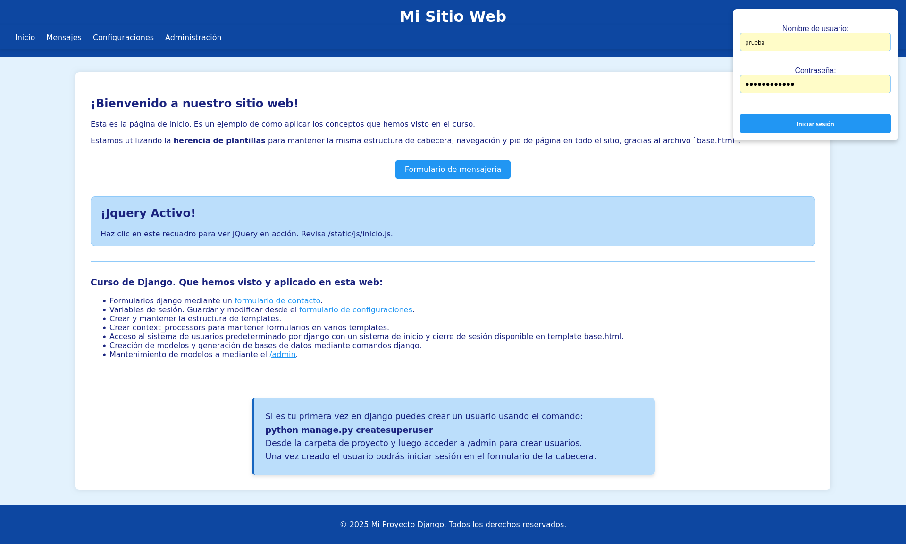

# 📝 Un gestor de contenido simple con Django 🚀

¡Bienvenido a este humilde proyecto desarrollado con **Django**! 
Este gestor de contenido te permite manejar publicaciones, autores y temáticas de una forma intuitiva. Es una base ideal para un blog personal, un portafolio de artículos o un sitio de noticias sencillo.



## ✨ Características clave

- **Sistema de autenticación**: Permite a los usuarios iniciar y cerrar sesión de forma segura.
- **Formularios dinámicos**: Incluye formularios para contacto y configuración, y utiliza `formsets` para gestionar la creación de autores y temáticas en una misma página, lo cual optimiza el flujo de trabajo.
- **Gestión de sesiones**: Permite guardar las preferencias del usuario, como el tema (claro/oscuro), para una experiencia personalizada.
- **Estructura modular**: El código está organizado en vistas claras que manejan distintas funcionalidades (página de inicio, contacto, login, etc.), lo que facilita la escalabilidad y el mantenimiento.

---

## ⚙️ Instalación y configuración

Sigue estos pasos para poner el proyecto en marcha en tu máquina local.

### 📋 Requisitos

Asegúrate de tener instalado **Python 3.x**.

### 💻 Pasos de instalación

1.  **Clonar el repositorio**
    ```bash
    git clone https://github.com/llx7y7ll/django
    cd django
    ```
2.  **Crear y activar un entorno virtual** (opcional pero muy recomendado)
    
    * **En Linux/macOS**
        ```bash
        python3 -m venv venv
        source venv/bin/activate
        ```
    * **En Windows**
        ```bash
        python -m venv venv
        venv\Scripts\activate
        ```
3.  **Instalar las dependencias**
    ```bash
    pip install django
    ```
    Si usas un archivo `requirements.txt`:
    ```bash
    pip install -r requirements.txt
    ```

---

## ▶️ Ejecución del proyecto

Sigue estas instrucciones para arrancar la aplicación.

1.  **Migrar la base de datos**
    ```bash
    python manage.py makemigrations
    python manage.py migrate
    ```
2.  **Crear un superusuario**
    Necesitas un superusuario para acceder al panel de administración de Django y gestionar los datos.
    ```bash
    python manage.py createsuperuser
    ```
    Sigue las instrucciones en la terminal para crear tu usuario y contraseña.
    
3.  **Lanzar el servidor de desarrollo**
    ```bash
    python manage.py runserver
    ```
    Una vez que el servidor esté en funcionamiento, puedes acceder a la aplicación en tu navegador en `http://127.0.0.1:8000`.

---

## 🧑‍💻 Vistas principales

Aquí hay un breve vistazo a las funcionalidades que manejas en tu archivo `views.py`:

- `home`: La página principal del sitio.
- `formulario_view`: Gestiona el formulario de contacto, validando los datos y redireccionando a una página de éxito si todo es correcto.
- `login_view`: Procesa la autenticación de usuarios. Si las credenciales son correctas, inicia la sesión.
- `logout_view`: Cierra la sesión del usuario.
- `config_view`: Permite cambiar el tema de la interfaz (`light` o `dark`) y guarda la preferencia en la sesión del usuario.
- `publicaciones_view`: Muestra un formulario para crear nuevos autores y temáticas utilizando `modelformset_factory`. Esto permite la creación de múltiples instancias de un modelo en un solo formulario, una funcionalidad muy potente para la entrada de datos en masa.

¡Espero que esta documentación te sea útil para tu proyecto! Si tienes alguna
